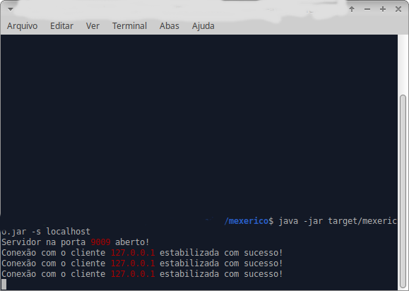
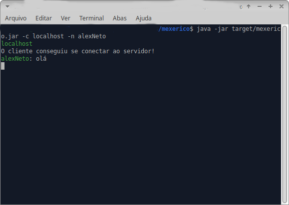
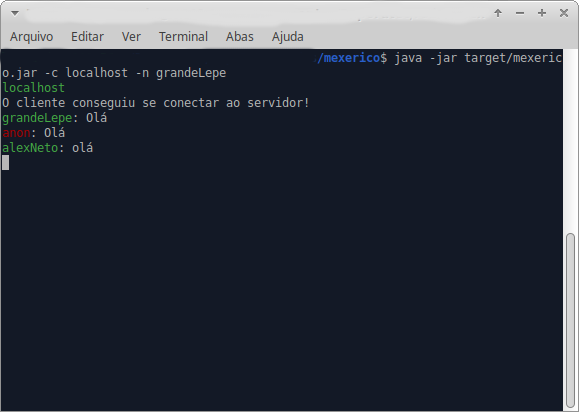
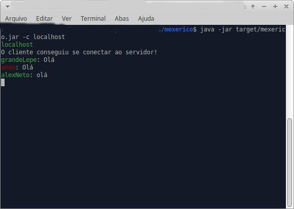

# mexerico
aplicativo de conversação via sockets, usando java

# Como usar

Primeiro faça a build do projeto com `$ mvn package`

para terstar localmente será necessário 3 terminais, uma para o servidor e outros 2 para testar os clientes

para subir o servidor basta o comando `$ java -jar target/mexerico.jar -s`. Para subir os clientes use `$ java -jar target/mexerico -c <ip> [-n <nome>]`

# Em funcionamento
Servidor: 

 
Cliente 1: 

 
Cliente 2: 

 
Cliente anonimo: 
